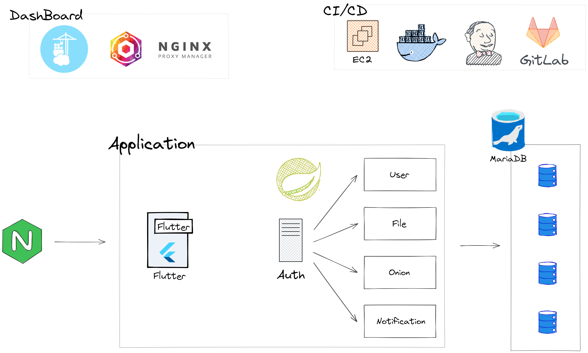
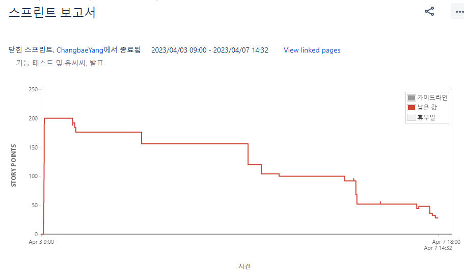
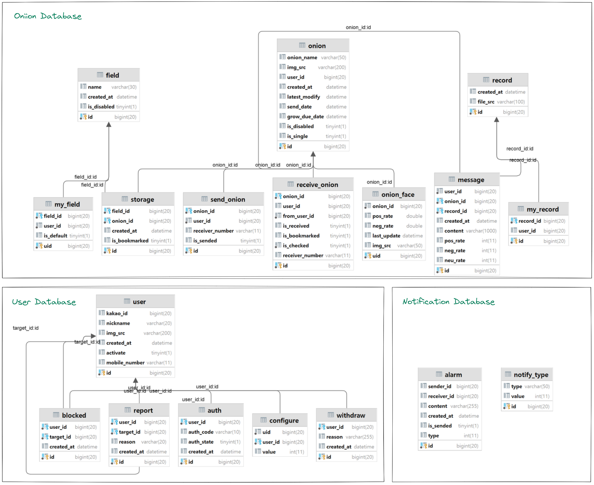
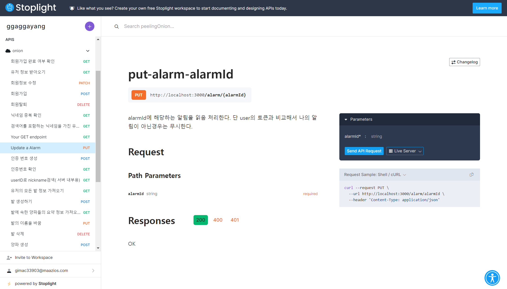

# 목차

1. [**서비스 소개**](#1)
2. [**기획 배경**](#2)
3. [**기능 소개**](#3)
4. [**기술 스택**](#5)
5. [**프로젝트 일정 및 산출물**](#6)
6. [**팀원 소개**](#7)

---

# 서비스 소개

### 서비스 명

- 서비스 명 : **`Peeling Onion`** ([원스토어](https://m.onestore.co.kr/mobilepoc/apps/appsDetail.omp?prodId=0000768589&scYn=Y))

### 개요

- 한 줄 소개 : 까면 깔 수록 눈물나는 양파처럼, 메시지도 까면 깔 수록 눈물나는 감동의 메시지를 전달하자!
- 기간 : 2023/02/20 ~ 2023/04/07
- [프로젝트 notion](https://www.notion.so/PJT-ca93b9ca550048bc8df961022be65e1f)

### 타겟

- 타인에게 색다른 메시지를 전달하고 싶은 사람
- 군대 간 남자친구에게 한 달간 느린 편지를 만들어 주고 싶은 사람
- 롤링 페이퍼를 만들어서 누군가에게 전달하고 싶은 사람들

# 🎞기획 배경

## 배경

다들 착한양파 나쁜양파 실험에 대해 알고 계실 겁니다. 양파에게 나쁜 말을 하면 자라지 못한다는 유사과학이죠. 과학적 근거가 없는 실험이지만, 실제 사람에게 나쁜말을 하면 안된다는 사실은 모두가 알 것입니다. 예쁜 말을 하면 더 좋고요!

저희는 이러한 요소에서 영감을 얻어, 타인에게 착한 말을 한 양파(녹음 메시지)를 보내는 서비스를 고안했습니다. 추가로 메시지가 예쁜 말인지 나쁜 말인지도 구분해서 알려주면서요!

## 목적 🧭

**친구/연인/가족에게 하고싶은 말들을 각자 녹음한 뒤, 이를 전달하자.**

## 의의

- 타인에게 하루 한 건 음성 메시지를 녹음한 뒤 이를 전달한다. (느린 편지)
- 여러 명이 하나의 양파에 접근하여, 각자 메시지를 녹음한 뒤 이를 전달한다.

# 💫 기능소개 

### 기능 소개

- 혼자 보내기
  - 일종의 느린 편지
  - 양파 생성 시 `수신자 전화번호`, `수확일` 을 입력한다.
  - 양파 생성 후, 사용자는 1일 1회 음성 메시지를 녹음할 수 있다.
  - 수확일이 지나면, 해당 양파를 수신자에게 전송할 수 있다. 이후 카카오톡으로 공유하여 수신자에게 이를 알릴 수 있다.
- 함께 보내기
  - 일종의 롤링 페이퍼
  - 양파 생성 시 `수신자 전화번호`, `수확일`, `함께 보낼 유저들`을 입력한다.
  - 양파 생성 후, 등록된 유저들은 1회 음성 메시지를 녹음할 수 있다.
  - 수확일이 지나면, 대표자(양파를 생성한 사람)가 양파를 수신자에게 전송할 수 있다. 이후 카카오톡으로 이를 공유할 수 있다.

### 화면 구성도

x

# 🐳기술 스택

## 0. 아키텍처 설계

## 1. 음성 인식 (STT)

### STT란?

음성 인식(Speech Recognition)이란 사람이 말하는 음성 언어를 컴퓨터가 해석해 그 내용을 문자 데이터로 전환하는 처리를 말한다. STT(Speech-to-Text)라고도 한다. 키보드 대신 문자를 입력하는 방식으로 주목을 받고 있다. - 출처 [구글 위키피디아](https://ko.wikipedia.org/wiki/%EC%9D%8C%EC%84%B1_%EC%9D%B8%EC%8B%9D)

### VITO

VITO Speech는 대본을 읽어서 만든 공개 데이터나 공개된 방송 등의 오디오가 아닌 VITO를 통해 사람이 일상에서 나누는 대화를 기반으로 학습한 인공지능입니다. - 출처 [VITO Open API](https://developers.vito.ai/?utm_source=vito_homepage&utm_medium=%EB%AC%B4%EB%A3%8C_click&utm_campaign=family_site_%EC%83%81%EB%8B%A8_api)

### 적용

1. 음성 메시지 녹음 시, VITO Open API를 사용하여 해당 메시지를 텍스트로 바꾸어 별도로 저장합니다.

## 2. 한국어 감정 분석

한국어로 된 텍스트에 담긴 감정을 긍정/중립/부정으로 분석/구분합니다.

### 네이버 CLOVA Sentiment

CLOVA Sentiment는 단어나 문장에 담긴 감정을 긍정, 부정, 중립으로 파악하여 알려주고 해당 문장에서 느껴지는 주요한 감정 표현을 추출해 주는 API입니다. - 출처 [네이버 CLOVA Sentiment](https://www.ncloud.com/product/aiService/clovaSentiment)

### 적용

1.  음성 데이터를 텍스트 데이터로 변환 후, 네이버 CLOVA Sentiment를 사용하여 긍정/부정/중립 비율을 구분합니다.
2.  해당 감정분석 비율에 따라 양파의 표정을 달리하여 출력합니다.

## 3. Flutter

> Flutter는 **Google에서 개발 및 지원하는 오픈 소스 프레임워크**입니다. 프런트엔드 및 풀 스택 개발자는 Flutter를 사용해 다수의 플랫폼에 대한 애플리케이션의 사용자 인터페이스(UI)를 단일 코드 베이스로 구축합니다. -출처 [aws - flutter란 무엇인가요](https://aws.amazon.com/ko/what-is/flutter/)

![](data:image/png;base64,iVBORw0KGgoAAAANSUhEUgAAAT8AAACdCAMAAAD124/IAAAAn1BMVEX///9G0f1wcHA/z/0fu/0HWZx0dHSQkJC8vLxlZWXHx8fNzc3Kysp5eXlsbGx9fX3f39/19fWDg4Pt7e2cnJympqbq+f8rzP3T09N12v6srKwAVZshX59ZWVnk7fT3/f8As/0ASpbW9P+U4v4ATpcfcrMAPpBQUFCG3v1d0v3L7v9Jb6gAQozI1uQFxv3V7/9Kxf4ffbvJ4/MAYa1Neq3Mb0aIAAAFFklEQVR4nO2aC3ebRhBG0dpaWCQWxMPGqDStY1dN6qRN2///2zqr5bEr2eUVH63a756TE4NZgq9nmNlRPA8AAAAAAAAAAAAAAAAAAAAAAAAAAAAAAAAAAAAAAAAAAAAAAAAAwFvcnfDh0g90VXz4eG/x9eHST3RVkL6V5kbz8dJPdFX0+hqBv176ia4KU98K+qZi6VsheSdi61tB3zRO9K2QvJM404fomwL0LQL6FoF33yLm6Cv93KYo1Vn6onz353WMWdEX1sxC8pDObqVg4Xs/r2PMS96t4Jyb/iLlbcNZ9D/zN/PdR/6i1MTfeOP8BXUtjBzf+YeDn81+/Eszt3RsBfOTs7Oj/HEWm/5yJour9Te78sKfYn7jAn/eor4P/pa1zfP9heTPXFkxWe3sS3ZlGG7P705k29CZ/nLRrmPA3zZOfeMHTfI4CjzVdcdpRI1PTAU7CnZeRTWcDnUlb2+3SWtB1CLvwzJPU6rvZUznD6e2L8SyTduAv1DKaNOfT3wplL9tLBnnunMU5K8QrDtm+naZL9Qp9UeKThWtD9XV5PosWi/Dwj3vkD/GY8sf0/64ENoMxZfyVwupZKlj3RQmKTXmgppLpr4jisYVrS8LulCtc8Lf0pHBPH9JEIQ5xVARELS8pL98ztJKHats3fkyknrlrmIsUkGq8BnLSalfZkkQOuDvTX13DxafHu5ev4Hyd141h/wpqP5GVv2VsuiMFJKLvD0qY8aF/iX5jFJcuF86Hm8s7j89vnEH2r/FedWjg2KWP6N/oeukUTW2MW/eduSvVekCj18X6jvOD5jsEDoYl/qrGJempZzx6HhM/tpUdoLH+5tF+k7nL03ULPRHbz+7lw5jrpOW/EmnmmxD4Bx92l/P9/FXpkxY7XeSMh12qn445a8XOEvf96wfvb+QmmlZG9AvSb8A6b1YOJS+ikZgr+9+gr6Z/YviX/wFsT2UVQhX/WmBnb7ff7q9WY3W907+Ih7FJzBn/R0jrv3/faTv1hA4pO99/FG54K83KU76I4GWPhI4Vt9kf3yMv03K3+iR3fTntZuLRl8rcFjfoD/apG3782E0yt8xTF/V5Ki/hk6fFjhC3+D8iuqA0YkEcpQ/L5c8te7afsNpf4Y+JXCMviF/JWViPyehI8sfP9n/dq0dFRBhjlcCkepLXfZn6bu9HaVvyF9GkdRN6dVB70/lshGaFH+siznagPQX0j8SMcmb/Zuz/k703f7xecyqofl9ILhM24moZKzXQkVCmq13JbnsfG7UyKUNx4AZ8xdn/XmfbYHPv/04YtGQv4QiiUk/2IS+oATN+/5FRaOMqzCvtCbVNAs/CHSmKmdS+FUY5JJ2H3Vj1mV/tsBvT09jBA5+frRRk3k1WKaMLJJC9mmpFKkJdFM1drnQg2Wd7iGlbLOOLmpruNP+TIHfntbrMQLDQ52e+wtpy9p6KqNafdjBhAwohetD/1oLpBrit/4oII9D/LbzS3wh9M6t7tM8rQ+OzQ8sOoHPL/v1ev3zsMBdkr3y8+yyLOvDpMwjxv3jZNU672VVzJjx+VyZc8l7P1ngp2lamHP6xFrvHo1A0rcfKRBYHAU+vzwd9Y1LYWBCAnXyriFwFn/+9bI2QApP5csvewhcgimQ6ggETsUQuIfAGbQClb09Ung6JNAEAqfyZf+Dyf5vCAQAAAAAAAAAAAAAAAAAAAAAAAAAAAAAAAAAAAAAAAAAAAAAAAAAAAAA4L/JP8jBfBj1ULL5AAAAAElFTkSuQmCC)

# 📅프로젝트 일정 및 산출물

## 프로젝트 진행

### 1. JIRA

매주 월요일 금주의 진행 이슈를 백로그에 등록했습니다. 

매일 오전 회의에서 데일리스크럼을 하고 해당 내역을 노션 회의록에 정리하였습니다.

JIRA 번다운 차트는 매주 아래와 같은 모양이 되도록 관리하였습니다.

### 2. 노션

[프로젝트 notion](https://www.notion.so/PJT-ca93b9ca550048bc8df961022be65e1f)

노션에서는 각 주의 일정 요약을 표시하고, 매일의 데일리스크럼 및 회의 내역을 기록하였습니다.

그 외에도 코드 및 git 컨벤션, 기획서, 참고 자료, 개발 로그 등을 수시로 업데이트하여 팀원 모두가 프로젝트 진행 상황과 일정을 쉽게 파악할 수 있었으며, 프로젝트 과정에서 생기는 혼란과 오류를 최소화하였습니다.

## 프로젝트 산출물

### 1. Figma

[peeling_onion figma](https://www.figma.com/file/DEr2Ksh6HnlYn2BbaZbT3q/Peeling_Onion(%EC%99%80%EC%9D%B4%EC%96%B4-%ED%94%84%EB%A0%88%EC%9E%84)?node-id=0-1&t=gwlM8lRXSTUrhKBc-0)

### 2. ERD

### 3. stoplight

백과 프론트 사이의 api 규격서는 stoplight 사이트를 이용했습니다.

백이 미완성된 상태에서도 stoplight의 Mock Server 를 이용해 Fake JSON api 요청을 보낼 수 있도록 하여, 프론트엔드 개발자는 백엔드 서버의 개발 완료 여부와 상관없이 개발 작업을 진행할 수 있었습니다.

stoplight 는 아래와 같이 관리했습니다.

# 🌈팀원 소개

[구성우](https://github.com/sungwookoo)

- 인프라 (CI/CD)
- 배포 사이트 제작

[류기혁](https://github.com/hyeok00)

- MSA, ERD 설계
- 유저 관리

[양창배](https://github.com/ChangbaeYang)

- API 설계 및 구현
- 디자인

[고영일](https://github.com/wallaby150)

- 프론트 인증 기능
- 프론트 유저 관리

[유혜빈](https://github.com/Hyebin-You)

- STT, 긍부정 판단, 알림 기능
- 디자인

[정동섭](https://github.com/JungDongSeop)

- 프론트 주요 기능

