# Sequence diagram

# Bookmark

### 북마크 추가 / 삭제

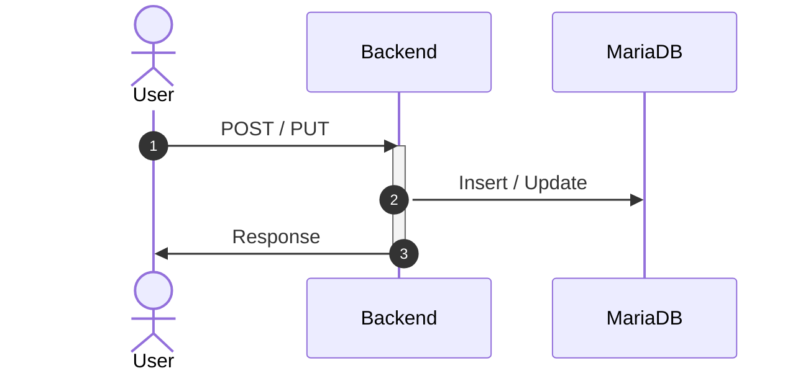
```mermaid
sequenceDiagram
	autonumber
	actor User
	User->>Backend: POST / PUT
	activate Backend
	Backend->>MariaDB: Insert / Update
	Backend->>User: Response
	deactivate Backend
	
```

### 북마크된 피드, 질문, 로드맵 가져오기

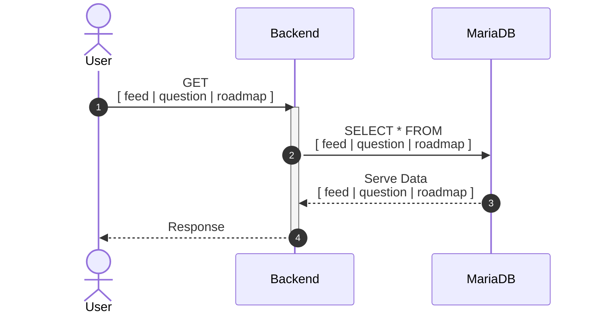
```mermaid
sequenceDiagram
	autonumber
	actor User
	User->>Backend: GET<br>[ feed | question | roadmap ]
	activate Backend
	Backend->>MariaDB: SELECT * FROM<br>[ feed | question | roadmap ]
	MariaDB-->>Backend: Serve Data<br>[ feed | question | roadmap ]
	Backend-->>User: Response
	deactivate Backend

```

# Company

### 회사 정보 조회

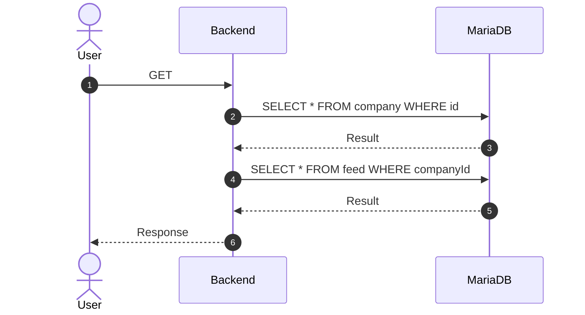
```mermaid
sequenceDiagram
	autonumber
	actor User
	User->>Backend: GET
	Backend->>MariaDB: SELECT * FROM company WHERE id
	MariaDB-->>Backend: Result
	Backend->>MariaDB: SELECT * FROM feed WHERE companyId
	MariaDB-->>Backend: Result
	Backend-->>User: Response
```

### 회사 로고 목록

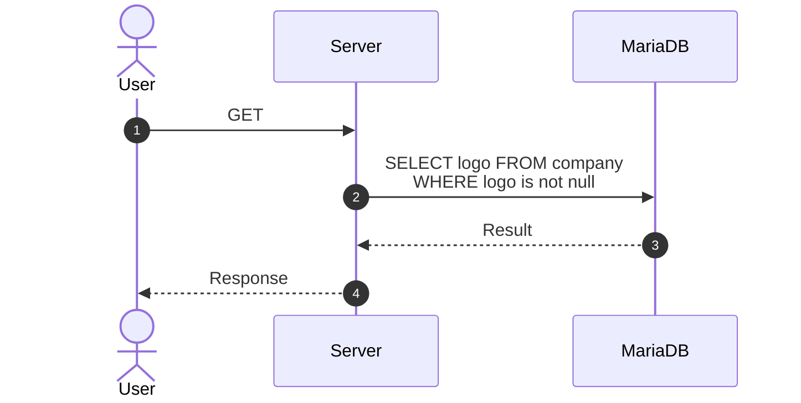
```mermaid
sequenceDiagram
	autonumber
	actor User
	User->>Server: GET
	Server->>MariaDB: SELECT logo FROM company<br>WHERE logo is not null
	MariaDB-->>Server: Result
	Server-->>User: Response
```

# Feed

### 검색

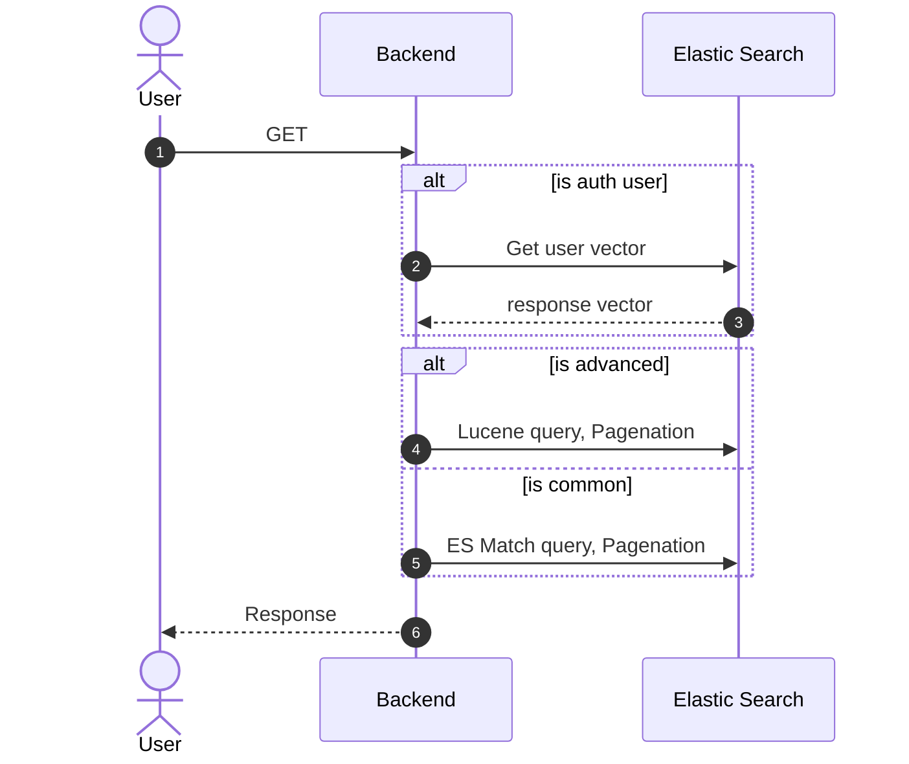
```mermaid
sequenceDiagram
	autonumber
	Actor User
	User->>Backend: GET
	alt is auth user
		Backend->>Elastic Search: Get user vector
		Elastic Search-->>Backend: response vector
	end
	alt is advanced
		Backend->>Elastic Search: Lucene query, Pagenation
	else is common
		Backend->>Elastic Search: ES Match query, Pagenation
	end
	Backend-->>User: Response
```

### 데이터 추가

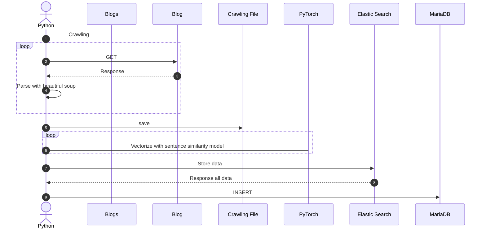
```mermaid
sequenceDiagram
	autonumber
	actor Python
	Python->Blogs: Crawling
	loop
		Python->>Blog: GET
		Blog-->>Python: Response
		Python->>Python: Parse with beautiful soup
	end
	Python->>Crawling File: save
	loop
		Python->PyTorch: Vectorize with sentence similarity model
	end
	Python->>Elastic Search: Store data
	Elastic Search-->>Python: Response all data
	Python->>MariaDB: INSERT
```

# Like

### 좋아요 등록 / 취소

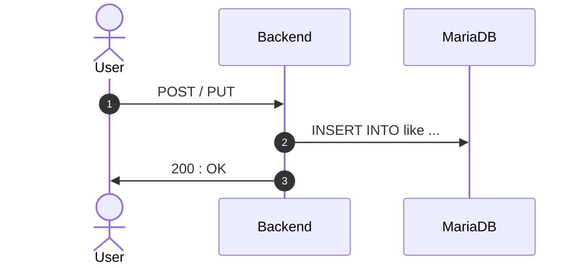
```mermaid
sequenceDiagram
	autonumber
	actor User
	User->>Backend: POST / PUT
	Backend->>MariaDB: INSERT INTO like ...
	Backend->>User: 200 : OK
```

# Notification

### 알림

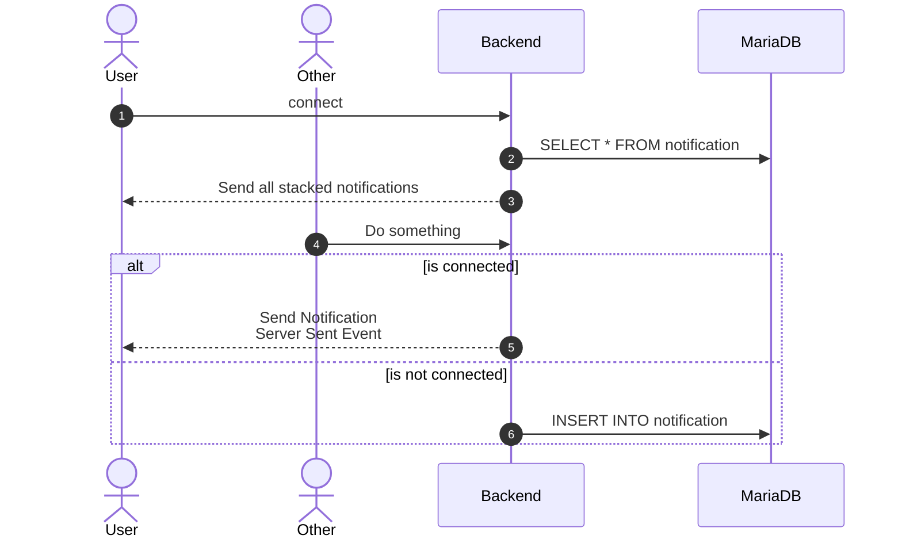
```mermaid
sequenceDiagram
	autonumber
	actor User
	actor Other
	User->>Backend: connect
	Backend->>MariaDB: SELECT * FROM notification
	Backend-->>User: Send all stacked notifications
	Other->>Backend: Do something
	alt is connected
		Backend-->>User: Send Notification<br>Server Sent Event
	else is not connected
		Backend->>MariaDB: INSERT INTO notification
	end
```

# Q&A

### Q&A 등록 / 수정

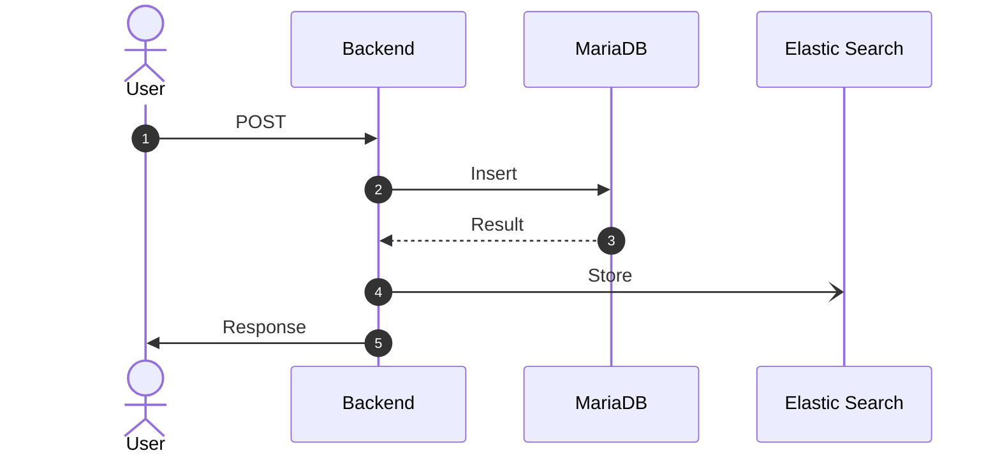
```mermaid
sequenceDiagram
	autonumber
	actor User
	User->>Backend: POST
	Backend->>MariaDB: Insert
	MariaDB-->>Backend: Result
	Backend-)Elastic Search: Store
	Backend->>User: Response
	
```

### 질문 검색

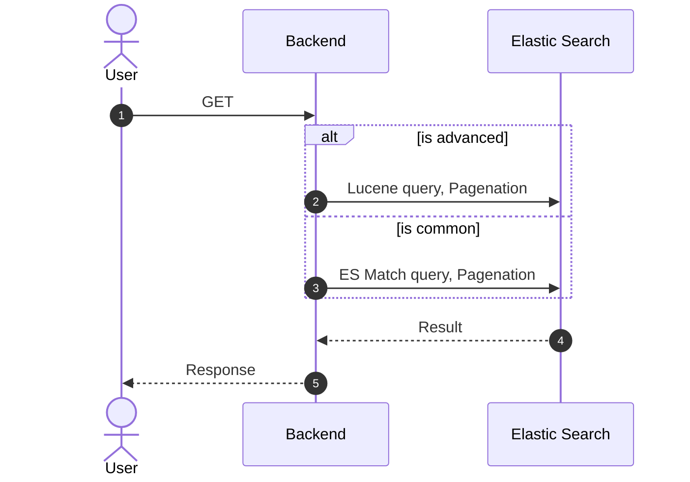
```mermaid
sequenceDiagram
	autonumber
	actor User
	User->>Backend: GET
	alt is advanced
		Backend->>Elastic Search: Lucene query, Pagenation
	else is common
		Backend->>Elastic Search: ES Match query, Pagenation
	end
	Elastic Search-->>Backend: Result
	Backend-->>User: Response
```

### 답변 등록

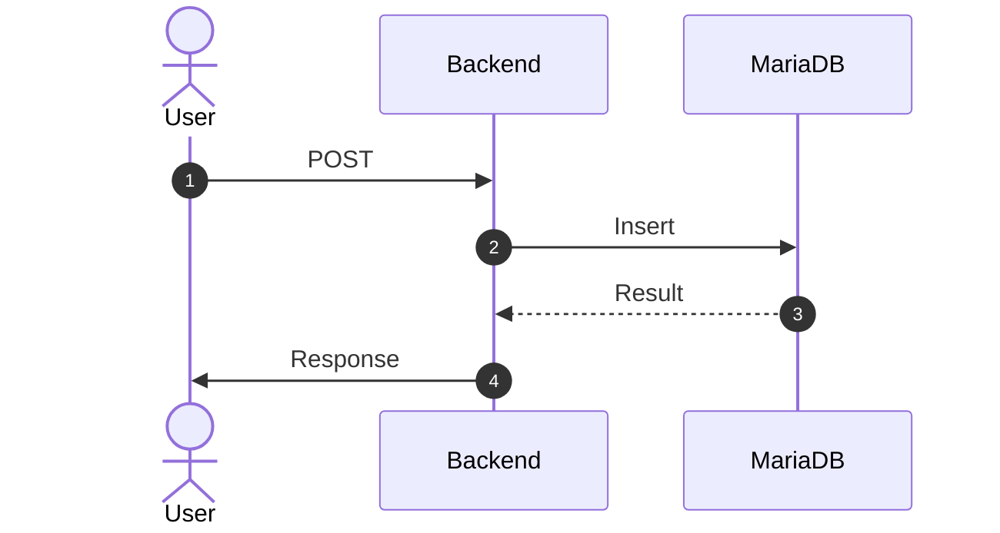
```mermaid
sequenceDiagram
	autonumber
	actor User
	User->>Backend: POST
	Backend->>MariaDB: Insert
	MariaDB-->>Backend: Result
	Backend->>User: Response
```

# Roadmap

### 로드맵 생성 / 수정 / 삭제

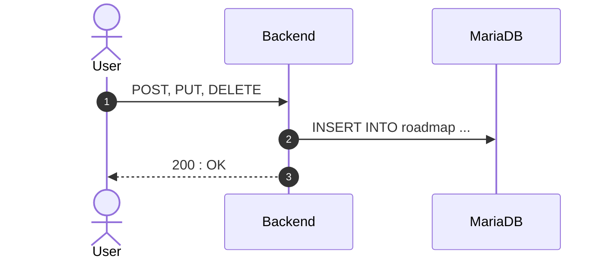
```mermaid
sequenceDiagram
	autonumber
	actor User
	User->>Backend: POST, PUT, DELETE
	Backend->>MariaDB: INSERT INTO roadmap ...
	Backend-->>User: 200 : OK
```

### 로드맵 조회

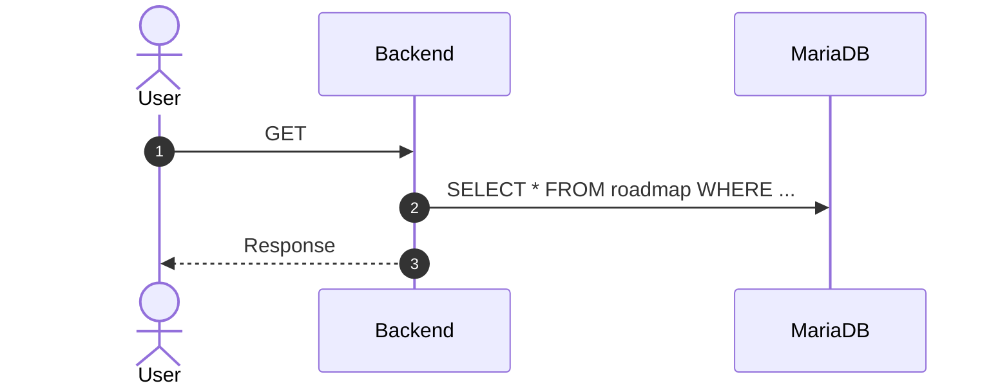
```mermaid
sequenceDiagram
	autonumber
	actor User
	User->>Backend: GET
	Backend->>MariaDB: SELECT * FROM roadmap WHERE ...
	Backend-->>User: Response
```

# Token

### 만료 상태 조회

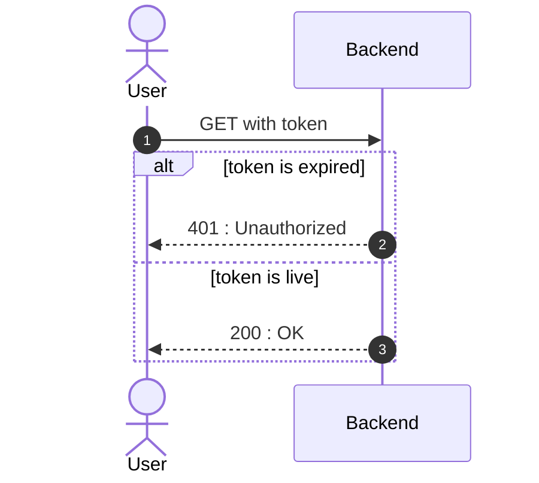
```mermaid
sequenceDiagram
	autonumber
	actor User
	User->>Backend: GET with token
	alt token is expired
		Backend-->>User: 401 : Unauthorized
	else token is live
		Backend-->>User: 200 : OK
	end
```

### 재발급

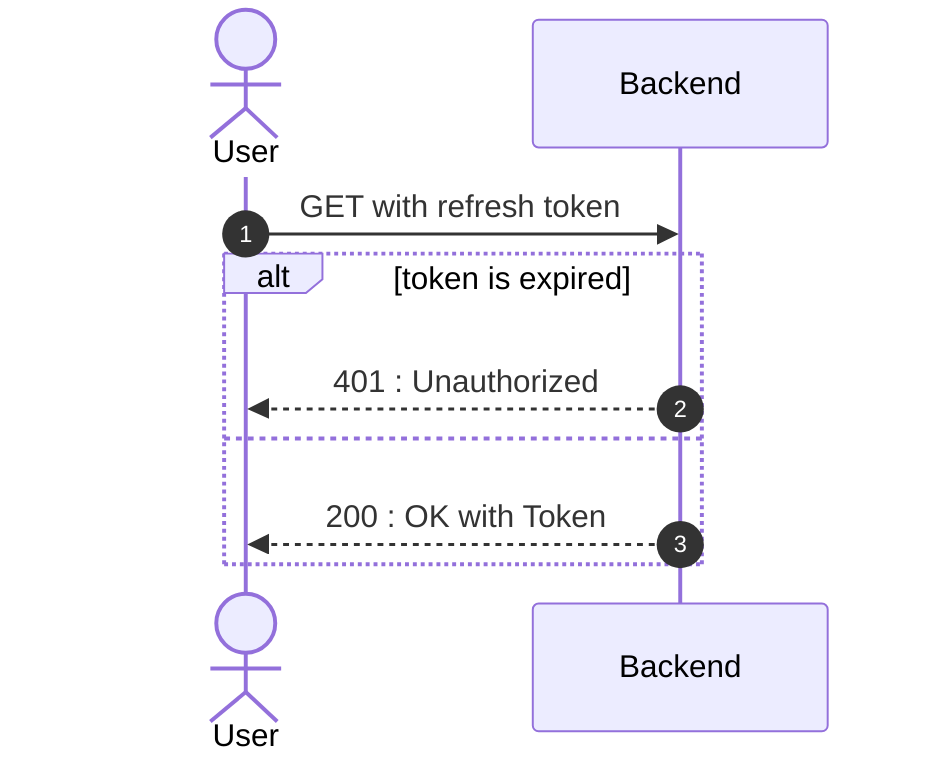
```mermaid
sequenceDiagram
	autonumber
	actor User
	User->>Backend: GET with refresh token
	alt token is expired
		Backend-->>User: 401 : Unauthorized
	else
		Backend-->>User: 200 : OK with Token
	end
```

# User

### 로그인 / 회원가입

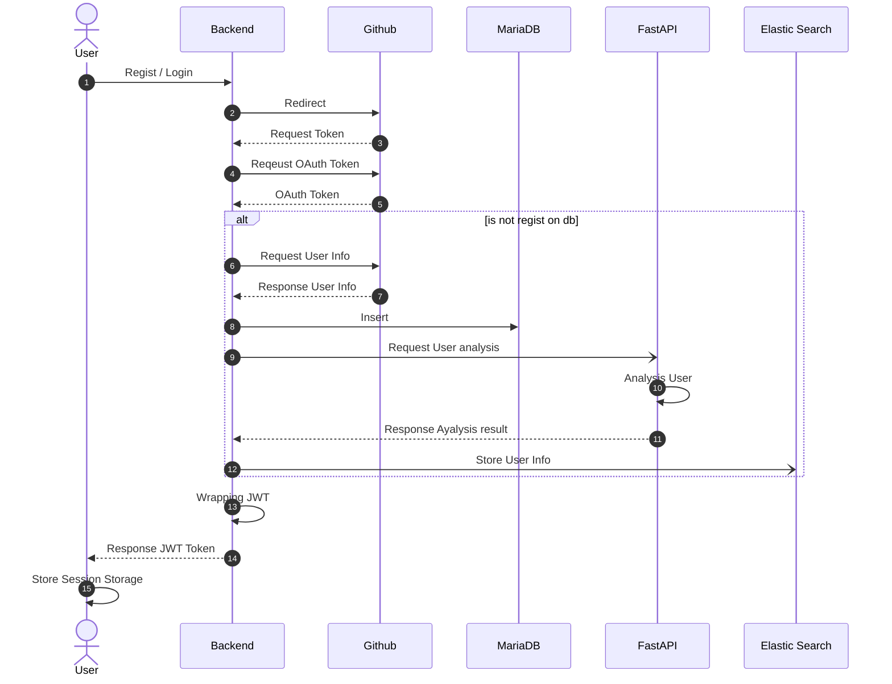
```mermaid
sequenceDiagram
	autonumber
	actor User
	User->>Backend: Regist / Login
	Backend->>Github: Redirect
	Github-->>Backend: Request Token
	Backend->>Github: Reqeust OAuth Token
	Github-->>Backend: OAuth Token
	alt is not regist on db
		Backend->>Github: Request User Info
		Github-->>Backend: Response User Info
		Backend->>MariaDB: Insert
		Backend-)FastAPI: Request User analysis
		FastAPI->>FastAPI: Analysis User
		FastAPI-->>Backend: Response Ayalysis result
		Backend-)Elastic Search: Store User Info
	end
	Backend->>Backend: Wrapping JWT
	Backend-->>User: Response JWT Token
	User->>User: Store Session Storage
```

### 질문 / 답변 목록

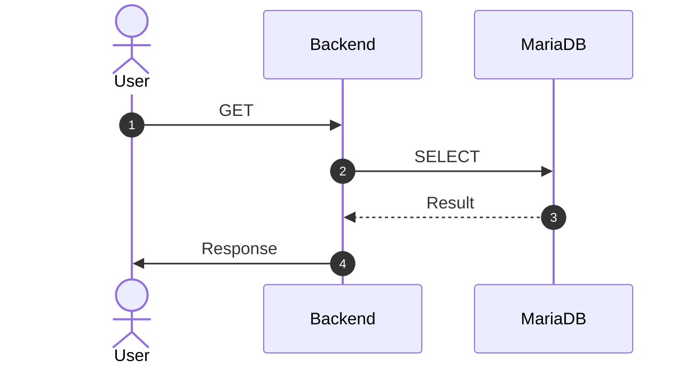
```mermaid
sequenceDiagram
	autonumber
	actor User
	User->>Backend: GET
	Backend->>MariaDB: SELECT
	MariaDB-->>Backend: Result
	Backend->>User: Response
	
```

### 최근 활동

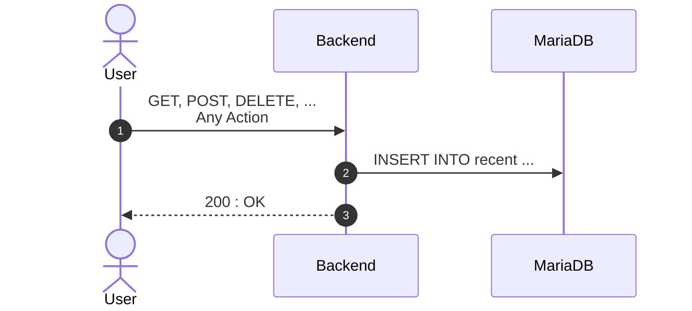
```mermaid
sequenceDiagram
	autonumber
	actor User
	User->>Backend: GET, POST, DELETE, ...<br>Any Action
	Backend->>MariaDB: INSERT INTO recent ...
	Backend-->>User: 200 : OK
```

### 뱃지 목록

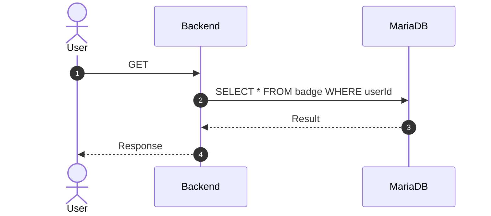
```mermaid
sequenceDiagram
	autonumber
	actor User
	User->>Backend: GET
	Backend->>MariaDB: SELECT * FROM badge WHERE userId
	MariaDB-->>Backend: Result
	Backend-->>User: Response
```

### 구독

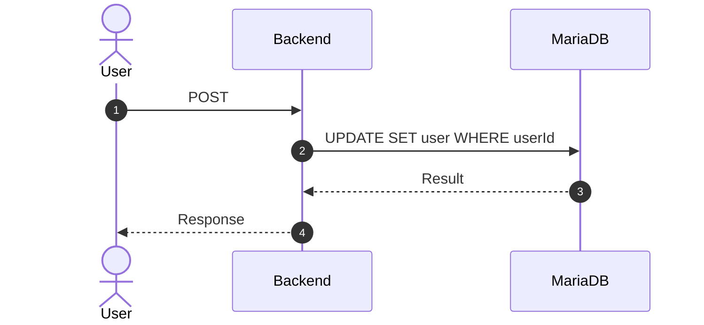
```mermaid
sequenceDiagram
	autonumber
	actor User
	User->>Backend: POST
	Backend->>MariaDB: UPDATE SET user WHERE userId
	MariaDB-->>Backend: Result
	Backend-->>User: Response
```

### 팔로우 추가 / 삭제

```mermaid
sequenceDiagram
	autonumber
	actor User
	User->>Backend: POST, PUT
	Backend->>MariaDB: INSERT INTO follow ...
	MariaDB-->>Backend: Result
	Backend-->>User: Response
```

### 팔로잉 / 팔로워 목록

```mermaid
sequenceDiagram
	autonumber
	actor User
	User->>Backend: GET
	Backend->>MariaDB: SELECT * FROM follow WHERE userId LIMIT 1;
	MariaDB-->>Backend: Result
	Backend-->>User: Response
```

### 유저 상세 정보

```mermaid
sequenceDiagram
	autonumber
	actor User
	User->>Backend: GET
	Backend->>MariaDB: SELECT * FROM user WHERE userId
	MariaDB-->>Backend: Result
	Backend-->>User: Response
```
